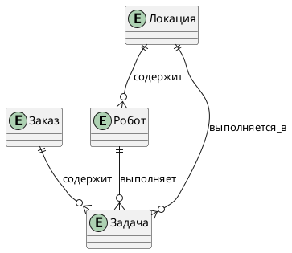
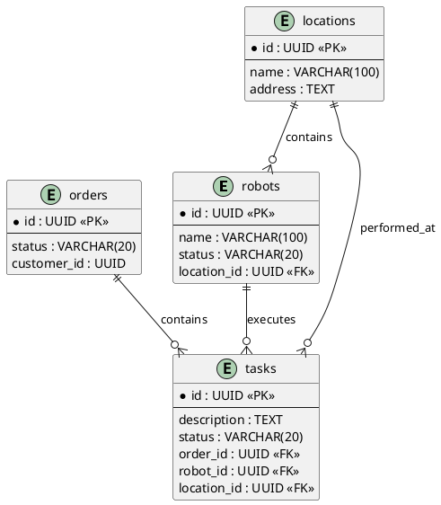
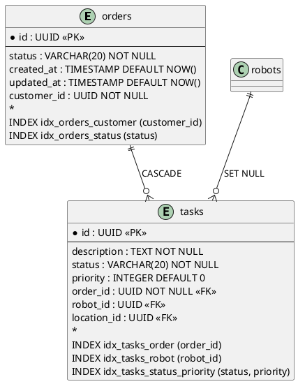

# 🗂️ ER-диаграммы (Entity-Relationship)

**Эта директория содержит ER-диаграммы, описывающие структуру данных системы на трёх уровнях абстракции.**  
ER-диаграммы (Entity-Relationship) — это стандартный способ визуализации модели данных, показывающий сущности, их атрибуты и связи между ними.

В этой папке собраны три уровня ER-модели, соответствующие этапам проектирования базы данных:

- **Концептуальная модель** — бизнес-сущности и их связи (без технических деталей).
- **Логическая модель** — атрибуты, типы данных, первичные и внешние ключи.
- **Физическая модель** — конкретная реализация в СУБД с индексами, ограничениями и типами.

ER-диаграммы — это **основной инструмент для проектирования и документирования структуры данных**. Они помогают согласовать модель с бизнес-требованиями, аналитиками и разработчиками.

---

## 🧭 Навигация по разделам

| Файл | Описание | Уровень | Аудитория |
|------|----------|---------|-----------|
| [conceptual.puml](conceptual.puml) | Концептуальная модель — бизнес-сущности и их связи | Высокий (Business) | Стейкхолдеры, аналитики, бизнес |
| [logical.puml](logical.puml) | Логическая модель — атрибуты, типы, ключи | Средний (Design) | Архитекторы, разработчики, DBA |
| [physical.puml](physical.puml) | Физическая модель — схема БД с индексами, ограничениями | Низкий (Implementation) | DBA, разработчики, DevOps |

---

## 🧠 Что такое ER-диаграммы

ER-диаграмма — это графическое представление модели данных, которое включает:

- **Сущности (Entity)** — объекты, о которых хранятся данные (например, «Робот», «Заказ»).
- **Атрибуты (Attributes)** — свойства сущностей (например, `name`, `status`, `created_at`).
- **Связи (Relationships)** — как сущности связаны друг с другом (например, «Заказ содержит Задачи», «Робот выполняет Задачу»).

Для нотации используется **«воронья лапка» (crow's foot)**, которая наглядно показывает мощность связей (один-к-одному, один-ко-многим, многие-ко-многим).

---

## 🧩 Три уровня ER-модели

### 1. Концептуальная модель (`conceptual.puml`)

**Что показывает:**
- Основные бизнес-сущности (например, `Robot`, `Task`, `Order`, `Location`).
- Связи между ними (без атрибутов).
- Мощность связей (1:1, 1:N, M:N).

**Когда использовать:**
- На этапе сбора требований и согласования с бизнесом.
- Для презентаций стейкхолдерам и аналитикам.
- Для определения границ предметной области.

**Пример:**

---

### 2. Логическая модель (`logical.puml`)

**Что показывает:**
- Все сущности с атрибутами (названия, типы данных).
- Первичные и внешние ключи.
- Детальные связи с указанием мощности.

**Когда использовать:**
- При проектировании структуры БД.
- Для обсуждения с разработчиками и DBA.
- Как основа для создания физической схемы.

**Пример:**

---

### 3. Физическая модель (`physical.puml`)

**Что показывает:**
- Конкретные имена таблиц и колонок (соответствуют `schema.sql`).
- Точные типы данных СУБД (например, `TIMESTAMP`, `INTEGER`, `UUID`).
- Индексы, ограничения (NOT NULL, DEFAULT, CHECK), каскадные действия.
- Все внешние ключи с указанием действий при удалении/обновлении.

**Когда использовать:**
- При создании миграций БД.
- Для понимания физической структуры данных.
- Для оптимизации запросов и производительности.

**Пример:**

---

## 🧠 Принципы построения ER-диаграмм

1. **Концептуальная → Логическая → Физическая.** Переход от бизнес-уровня к технической реализации.
2. **Единая нотация — crow's foot.** Используем стандартную нотацию «воронья лапка» для мощности связей.
3. **Имена на английском** в логической и физической моделях (для совместимости с кодом и SQL).
4. **Синхронизация с `schema.sql`.** Физическая модель должна полностью соответствовать схеме БД.
5. **Индексы и ограничения** — обязательны в физической модели для понимания производительности.
6. **Комментарии в диаграммах** поясняют бизнес-смысл, если он не очевиден.

---

## 🚀 Как использовать ER-диаграммы

1. **Начни с концептуальной модели** — согласуй с бизнесом и аналитиками основные сущности и связи.
2. **Перейди к логической модели** — детализируй атрибуты, типы и ключи.
3. **Создай физическую модель** — на основе логической модели разработай схему БД с учётом индексов и ограничений.
4. **Сгенерируй SVG** из `.puml` файлов для встраивания в документацию.
5. **Обновляй модели при каждом изменении структуры данных** — синхронизируй с `schema.sql` и ADR.

---

## 📌 Важно

- **Концептуальная модель** должна быть понятна не-техническим специалистам.
- **Логическая модель** служит мостом между бизнесом и разработкой.
- **Физическая модель** — это точное отражение реальной схемы БД.
- **Все три уровня должны быть согласованы.** Изменение в одном → обновление всех.

---

## 📎 Связанные документы

- [Модель данных](../../data-model/README.md) — текстовое описание сущностей и `schema.sql`.
- [Диаграммы C4](../c4/README.md) — показывают контейнеры БД на уровне контейнеров.
- [Диаграммы UML](../uml/README.md) — классы соответствуют сущностям из ER.
- [ADR: Выбор PostgreSQL как основной БД](../../../adr/005-database-choice.md) — обоснование выбора СУБД.

---

*ER-диаграммы — это не просто картинки, а **модель, которая связывает бизнес-сущности с физической реализацией**.*

---